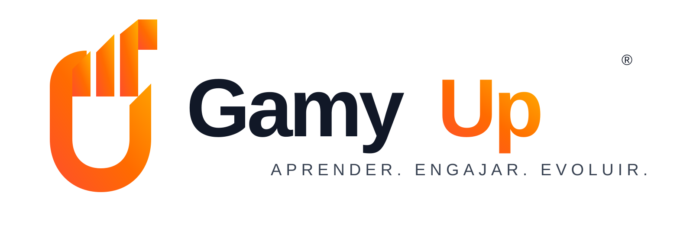

# GamyUp — Aprender. Engajar. Evoluir.

Gamificação para Treinamentos Corporativos

MVP funcional de plataforma de gamificação para cursos, treinamentos, workshops e programas de desenvolvimento corporativo, inspirada na lógica do Kahoot, com foco em presença, participação e evolução dos participantes.

## Stack

- **Backend** (`/server`): Node.js + Express + TypeScript, SQLite (better-sqlite3), Socket.io (tempo real), JWT (autenticação).
- **Frontend** (`/client`): React + TypeScript + Vite, Tailwind CSS v4, React Router, socket.io-client, geração de QR Code (`qrcode`) e leitura de QR Code (`html5-qrcode`).

## Funcionalidades implementadas (MVP)

- Login / cadastro de participantes e login de administrador (facilitador).
- Estrutura hierárquica: Programa → Treinamento → Turma → Encontro → Atividades.
- Check-in com pontuação por pontualidade (adiantado / no horário / atrasado, com tolerância configurável) via QR Code.
- Geração de QR Code por atividade (check-in, quiz, chuva de palavras, dinâmica, pesquisa, check-out).
- Quiz ao vivo (estilo Kahoot): perguntas com tempo, alternativas, bônus de velocidade, revelação de resultado em tempo real.
- Chuva de palavras com nuvem atualizada em tempo real (tamanho proporcional à frequência).
- Dinâmicas com conclusão pontuável.
- Pesquisas rápidas (estrelas, múltipla escolha, resposta aberta).
- Check-out com resumo final (pontos, posição no ranking).
- Sistema de pontos configurável (`/admin/settings`), com extrato completo por participante.
- Ranking geral / por turma / por encontro, com destaque para o usuário logado.
- Conquistas (badges) e níveis de evolução (Explorador → Líder) com barra de progresso.
- Dashboard do participante (progresso, próximo treinamento, conquistas).
- Painel do administrador com controle do encontro em tempo real (check-ins, participação por atividade, ranking).
- **Modo Apresentação**: tela cheia para projeção (QR Code, ranking, chuva de palavras, quiz ao vivo).
- Histórico do participante e relatório da turma para o administrador.
- Layout responsivo (mobile-first), com navegação inferior no celular.

## Como rodar localmente

Pré-requisito: Node.js 18+ instalado.

### 1. Backend

```bash
cd server
npm install
npm run seed   # cria dados de demonstração (apenas na primeira vez)
npm run dev    # inicia o servidor em http://localhost:4000
```

### 2. Frontend

Em outro terminal:

```bash
cd client
npm install
npm run dev    # inicia o app em http://localhost:5173
```

Abra `http://localhost:5173` no navegador.

### Contas de demonstração (criadas pelo seed)

- **Admin/Facilitador:** admin@demo.com / admin123
- **Participantes:** carlos@demo.com, beatriz@demo.com, diego@demo.com, fernanda@demo.com, gabriel@demo.com — senha `123456`

O seed já cria um programa ("Academia de Líderes"), um treinamento, uma turma com os 5 participantes matriculados e um encontro de hoje com todas as atividades (check-in, chuva de palavras, quiz com 3 perguntas, dinâmica, pesquisa e check-out).

## Publicar em produção (Render)

O projeto já vem com um [render.yaml](render.yaml) pronto (Render Blueprint) que sobe dois serviços:

- `gamyup-server`: API Node/Express, com disco persistente para o banco SQLite.
- `gamyup-client`: build estático do frontend (Vite).

Passo a passo:

1. Crie um repositório no GitHub e envie este projeto para lá (`git remote add origin <url>` + `git push -u origin main`).
2. No [Render](https://render.com), clique em **New > Blueprint** e conecte o repositório. O Render vai ler o `render.yaml` e propor os dois serviços automaticamente.
3. Confira os nomes dos serviços na tela de revisão do Blueprint. Se `gamyup-server` ou `gamyup-client` já estiverem em uso por outra pessoa no Render, o nome final (e a URL `https://<nome>.onrender.com`) vai mudar — nesse caso, depois do primeiro deploy, atualize manualmente as env vars:
   - em `gamyup-server`: `CLIENT_URL` → URL pública do frontend;
   - em `gamyup-client`: `VITE_API_URL` → URL pública do backend (e refaça o deploy do frontend, pois essa variável é usada no build).
4. Rode o seed de dados de demonstração uma vez, direto no shell do serviço `gamyup-server` no painel do Render: `npm run seed`.
5. Pronto — acesse a URL do `gamyup-client`. Os QR Codes gerados pelo admin já vão apontar para essa URL pública (variável `CLIENT_URL` do backend), então funcionam também quando escaneados por celular.

> O plano gratuito do Render "dorme" o backend após alguns minutos sem uso — a primeira requisição depois disso demora alguns segundos para acordar o serviço. Isso é normal e não afeta os dados salvos (o disco persistente mantém o SQLite intacto).

## Próximos passos sugeridos

- Emissão automática de certificado (estrutura de dados já preparada para critérios de conclusão).
- Relatórios avançados e exportação (CSV/Excel).
- Notificações push / e-mail para lembrar participantes do próximo encontro.
- Testes automatizados (unitários e end-to-end).
